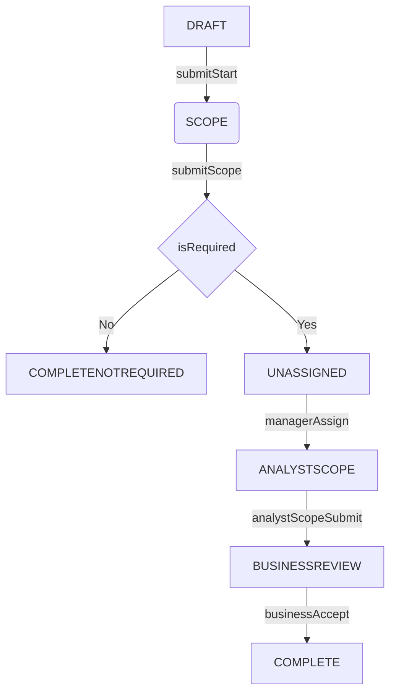
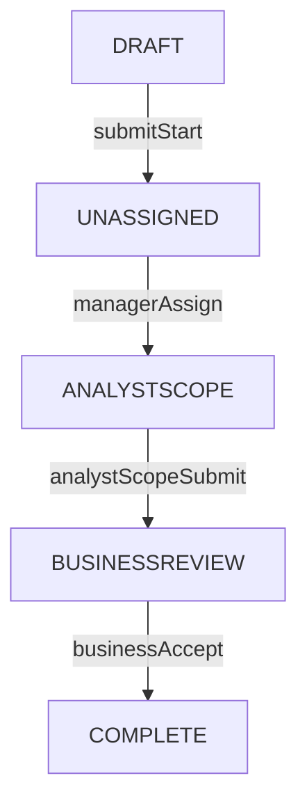

# mermaid

## contract

```mermaid
graph TD
draft[DRAFT] -->|submitStart| scope(SCOPE)
scope --> |submitScope|isRequired{isRequired}
isRequired -->|No| completeNotRequired[COMPLETENOTREQUIRED]
isRequired -->|Yes| unassigned[UNASSIGNED]
unassigned -->|managerAssign| analystScope[ANALYSTSCOPE]
analystScope --> |analystScopeSubmit| businessReview[BUSINESSREVIEW]
businessReview --> |businessAccept|complete[COMPLETE]
```

## support

```mermaid
graph TD
draft[DRAFT] -->|submitStart| unassigned[UNASSIGNED]
unassigned -->|managerAssign| analystScope[ANALYSTSCOPE]
analystScope --> |analystScopeSubmit| businessReview[BUSINESSREVIEW]
businessReview --> |businessAccept|complete[COMPLETE]
```

## advice

```mermaid
graph TD
draft[DRAFT] -->|submitStart| unassigned[UNASSIGNED]
unassigned -->|managerAssign| analystScope[ANALYSTSCOPE]
analystScope --> |analystScopeSubmit| businessReview[BUSINESSREVIEW]
businessReview --> |businessAccept|complete[COMPLETE]
```
